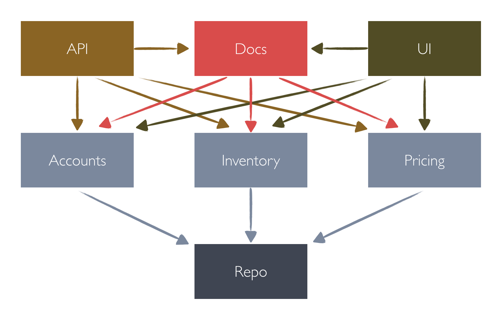

# AXR

**Ruby architecture for simplicity and team adoption**

Architecture's hard. It’s very easy to build a complex system. Much harder to build a simple and adaptable solution. The code doesn't matter. Coding for the sake of writing code is foolish.

Only a few of us get to write software that survives 5-10 years or longer. 90% of our work is garbage that becomes obsolete in 1-3 years after release. Most of our work hours are wasted on features that will never be useful.

This is just a reality.


(c) Volodya Sveredyuk

## Setup

```sh
gem install axr
```

or in your Gemfile
```ruby
gem 'axr'
```

in console
```sh
bundle install
```

## DSL

In your ruby app: (for rails app put it into `config/initializers/axr.rb` file)
```ruby
require 'axr'

AxR.app.define do
  layer 'Api'
  layer 'YourBusinessLogic'
  layer 'Repo'
end
```

By default, layers will get level from top to bottom.
```
Api -> 0
YourBusinessLogic -> 1
Repo -> 2
```

Layers with lower-level have less isolation.

- `Api` knows about `YourBusinessLogic` and `Repo`
- `YourBusinessLogic` knows about `Repo` but don't know anything about `Api`
- `Repo` fully isolated and don't familiar with `Api` and `YourBusinessLogic`

**Options**

```ruby
require 'axr'

AxR.app.define do
  layer 'A'
  layer 'B', familiar_with: 'C'
  layer 'C', familiar_with: 'B'
  layer 'D', isolated: true
  layer 'E', isolated: true
end
```

```ruby

# app.define options
AxR.app.define(isolated: true) # All layers will be isolated by default
AxR.app.define(familiar_with: ['D', 'E') # All layers will be familiar with D and E by default

# layer options
familiar_with: [...] # Can operate with other layers
isolated: true # 100% isolated and should not operate with other layers
isolated: true, familiar_with: [...] # Isolated from all except familiars
```

Can organize knowledge structure like:


## CLI

Run `AxR` checker in console
```sh
axr check . --load path/to/you/app/autoload.rb
```

For rails apps
```sh
axr check . --load config/environment
```

Run for a specific directory
```sh
axr lib/adapters
```

Run for a specific file
```sh
axr lib/adapters/youtube.rb
```

Finish scanning with status code 1 in case of any warnings (you can use in CI environment to fail pipeline step)
```sh
axr check --exit-on-warning`
```

## More examples

**ERP system**



```ruby
if Rails.env.development? || Rails.env.test?
  require 'axr'

  AxR.app.define(isolated: true) do
    layer 'UI',         familiar_with: %w[Docs Inventory Production]
    layer 'API',        familiar_with: %w[Docs Inventory Production]
    layer 'Docs',       familiar_with: %w[Inventory Accounts Repo]
    layer 'Accounts',   familiar_with: %w[Repo]
    layer 'Inventory',  familiar_with: %w[Repo]
    layer 'Production', familiar_with: %w[Repo]
    layer 'Repo'
  end
end

```

### TODO
- Add sublayers
- Add rubocop cop
- Add more app examples
- Migrate to AST analyzer
